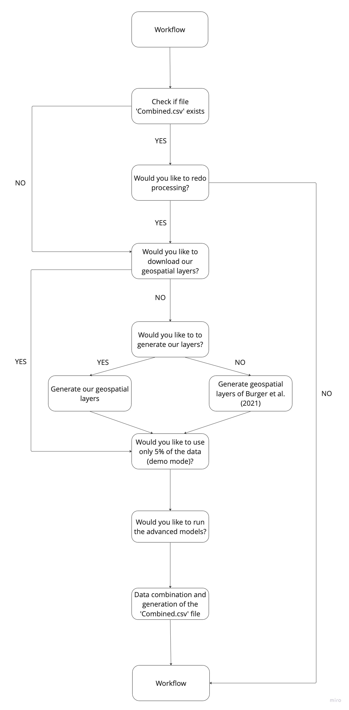

Course: Proseminar in Applied Geo-Data Science at the University of Bern
(Institute of Geography)

Supervisor: Prof. Dr. Benjamin Stocker

Adviser: Dr. Laura Marques, Pepa Aran

Further information: <https://geco-bern.github.io/agds_proseminar/>

[Do you have questions about the workflow? Contact the
authors:]{.underline}

Tinner Nils (nils.tinner\@students.unibe.ch) had the lead for the work
package 1 (WP1):

-   Data wrangling

-   Data (pre)processing

-   Open sciences and reproducible workflow

-   Advanced models (XGB and neuronal network)

Bigler Patrick (patrick.bigler1\@students.unibe.ch) had the lead for the
work package 2 (WP2):

-   Model implementation and calculations

-   Model tuning

-   Model evaluation

-   Visualize the key findings

-   Structure and design of this markdown and the workflow

\-\-\-\-\-\-\-\-\-\-\-\-\-\-\-\-\-\-\-\-\-\-\-\-\-\-\-\-\-\-\-\-\-\-\-\-\-\-\-\-\-\-\-\-\-\-\-\-\-\-\-\-\-\-\-\-\-\-\-\-\-\-\-\-\-\-\-\-\-\-\-\-\-\-\-\-\-\-\-\-\-\-\-\-\-\-\-\-\--

# Introduction\^WP1, WP2\^

Anthropogenic climate change is expected to increase the amount, intensity,
and duration of heat waves [@burger2021]. The urban heat island (UHI)
effect further amplifies this trend in urban environments [@burger2021;
@gubler2021; @wicki2018]. The UHI effect is expressed by higher air
temperatures in urban areas compared to rural areas in the region
[@oke2017]. The effect is highest during night, as the emission of
long-wave radiation in urban environments is impaired and sensible heat
fluxes are enhanced, whilst latent fluxes are reduced [@burger2021;
@gubler2021]. People living in urban areas are thus highly affected by the
UHI effect via thermal stress [@burger2021; @wicki2018]. Given that more
than 75% of the Central European population lives in urban areas, the
increasing trend poses one of the major weather threats to people in urban
environments [@wicki2018]. Studying spatial temperature variability in
urban areas is therefore crucial to implement adaptation measures to
minimize effects on human health and the environment [@burger2021].

To capture small-scale temperature changes in these climatically complex
areas, high spatial resolution measurement networks are needed. However,
automated weather stations (AWS) are scarce due to their high costs. To
tackle this problem, @gubler2021 developed a new type of low-cost
measurement devices (LCDs). The LCD consists of a temperature logger and a
custom-made radiation shield that is naturally ventilated. 79 LCDs were
installed in the city of Bern, Switzerland in 2018 [@gubler2021]. The study
reported an overestimation of hourly mean temperature measurements by the
LCDs (0.61 °C - 0.93 °C) compared to the reference station (AWS) during
daytime (06:00 -- 22:00). During night-time (22:00 -- 06:00), differences
were much lower or even negative (between -0.12 °C and 0.23 °C). But not
only the LCD temperature and the anomaly between the LCDs and the AWS is
interesting, but also the temperature distribution of the entire suburban
region of the city of Bern, shown on a map [@gubler2021].

In spring 2023, Nils Tinner generated a map of the current LCDs temperature
in the city of Bern based on the study of @burger2021. He improved the map
in June 2023 by also using geospatial data from the study of @burger2021.
These improvements enabled him to generate a map showing the spatial
temperature distribution of the suburban area of the city of Bern. The
approach used was a classic multivariate linear regression model. As the
model only knows the current temperature distribution, its scope and
statistical power are limited. But because both @burger2021 and @gubler2021
showed that the city of Bern is affected by the urban heat island effect it
is crucial to know more about it. This fact and the limited power of the
first map from Nils Tinner motivated us to investigate the urban heat
island using machine learning techniques.

## Objectives and Research Questions

@burger2021 used a multiple linear regression approach to model the urban
heat island effect in the city of Bern for a nighttime mean. In this study
we aim to calculate our own models at an hourly rate all day. Furthermore,
we will implement a classic approach (multiple linear regression model) and
machine learning approaches (k-nearest neighbors (knn) and random forest).
We use two sets of geospatial layers. First, we use the same set as
@burger2021 with the same zonal mean per predictor class. The predictor
class represents the original layer without processing, for example the
vegetation height. These are cut to the extent of the city and its
surrounding lands as well as a spatial resolution of 5 meters and will be
in the raw-data folder. But since @burger2021 was selecting layers with
nighttime mean modelling in mind this study also uses generated geospatial
layers with several zonal mean distances per predictor class (these will be
introduced in the data section). Therefore, the following questions arise:

1.  Are the two machine learning approaches (knn and random forest)
    reasonable approaches for modeling the urban heat island effect in the
    city of Bern in terms of explaining the variance ($R^2$), the precision
    (RMSE) and the accuracy (bias)?
2.  Are the machine learning approaches superior to a multiple regression
    model in terms of explaining the variance ($R^2$), the precision (RMSE)
    and the accuracy (bias)?
3.  How do models with the geospatial layers of @burger2021 compare to our
    models containing several zonal means per predictor class in terms of
    explaining the variance ($R^2$), the precision (RMSE) and the accuracy
    (bias)?
4.  Can a meaningful map be generated from the best model that shows the
    spatial distribution of the temperature anomaly in the suburban area of
    the city of Bern?

# Data and Methodology

In this section, we introduce you to the data used and the methodology
wehave chosen. Firstly, we present the data employed in our study.
Followingthat, we delve into the methodology, starting with the processing
ofgeospatial layers and an explanation of how we determined which
variablesto use. To address the research questions, we guide you through
the 'modes'in which you can execute this workflow. Finally, we provide an
overview ofthe implemented model.

## Data^WP1^

To avoid misunderstanding we want to start with a brief clarification: This
project uses cantonal land use data and federal geospatial data. These
intheir raw form are called predictor classes. These are then spatially
averaged to obtain the actual predictors which are called geospatial layers
or just predictors.

Temperature data for the years 2019-2022 from the network of the city
ofBern is used. This is a numerical data set of the 3m temperature in
104locations, with a temporal resolution of 10 minutes for all LCDs. How
manyLCD are active depends on the year but 55 LCDs are active over the
entiretime period (see table 1). The network data is publicly available on
BORIS,however since data on BORIS is faulty at the moment we uploaded
thecorrected .csv-files to the Github Repo. The original files can be
found[here](https://boris.unibe.ch/161882/), as well as the metadata
containingthe logger location. We use additional data from the AWS at
Zollikofen, asit is the official meteorologic station of Bern. The five
meteorological variables (2m temperature, precipitation, radiation and wind
direction and wind speed) with a temporal resolution of 10 minutes for the
years2019-2022 will be used as well as the timestamp. Data of
temperature(average) and precipitation (sum) of the previous six hours and
twelve hours, and one, three and five days and ten days (precipitation
only) will also be fed into the model. This data is uploaded to the
repository to ensure availability since the IDAWEB-data service is open for
scientific use but not completely open access. To show small scale urban
patterns of temperature distributions, zonally meaned geospatial data as
shown [in\@burger2021](mailto:in@burger2021){.email} is used. These are
cantonal land use classes as well as federal geospatial data. All of the
data is spatially averaged to obtain the layers most effective as shown in
@burger2021. The federal data (meteorologic values, DEM, and VH) and
cantonal data (all land cover classes: LC/OS/BH)is directly downloaded from
the web into R and then used as predictor classes. The geospatial layers
ROU, FLAC, ASP, SLO are calculated based on these data sets and are then
used as predictor classes. Table 1 provides a brief overview of the data we
will use.

| Predictor class                                                      | Variable Type    | Zonal Mean Resolution / [3 predictors per class] [@burger2021] |
|-------------------------------|----------------|----------------------------|
| 2m Temperature in °C [Zollikofen] for the time period 2019 - 2022    | Meteorological   | 15 minutes / [1h mean, 6,12,24,72,120 hours rolling mean]      |
| Precipitation in mm [Zollikofen] for the time period 2019 - 2022     | Meteorological   | 15 minutes / [1h mean, 6,12,24,72,120,240 hours rolling sum]   |
| Radiation in $W*m^{-2}$ [Zollikofen] for the time period 2019 - 2022 | Meteorological   | 15 minutes / [1h mean]                                         |
| Windspeed in $m*s^{-1}$ [Zollikofen] for the time period 2019 - 2022 | Meteorological   | 15 minutes / [1h mean]                                         |
| Winddirection in ° [Zollikofen] for the time period 2019 - 2022      | Meteorological   | 15 minutes / [1h mean]                                         |
| Land Cover Building [LC_B]                                           | Geospatial Layer | [25m / 150m / 1000m], Burger used [250m]                       |
| Open Space Forest [OS_FO]                                            | Geospatial Layer | [[25m / 150m / 1000m], Burger used [250m]                      |
| Open Space Garden [OS_GA]                                            | Geospatial Layer | [25m / 150m / 1000m], Burger used [25m]                        |
| Open Space Sealed [OS_SE]                                            | Geospatial Layer | [25m / 150m / 1000m], Burger used [500m]                       |
| Open Space Agriculture [OS_AC]                                       | Geospatial Layer | [25m / 150m / 1000m], Burger used [500m]                       |
| Open Space Water [OS_WA]                                             | Geospatial Layer | [25m / 150m / 1000m], Burger used [150m]                       |
| Vegetation Height [VH]                                               | Geospatial Layer | [25m / 150m / 1000m], Burger used [150m]                       |
| Mean Building Heights [BH]                                           | Geospatial Layer | [25m / 150m / 1000m], Burger used [150m]                       |
| Slope [SLO]                                                          | Geospatial Layer | [25m / 150m / 1000m], Burger used [100m]                       |
| Digital Elevation Model (DEM)                                        | Geospatial Layer | No zonal mean                                                  |
| Aspect [ASP]                                                         | Geospatial Layer | [25m / 150m / 1000m], Burger used [150m]                       |
| Flow accumulation [FLAC]                                             | Geospatial Layer | [25m / 150m / 1000m], Burger used [200m]                       |
| Roughness [ROU]                                                      | Geospatial Layer | [25m / 150m / 1000m], Burger used [25m, replaces SVF]          |
| Climate Network in °C (80 LCDs, different sides) in year 2019        | Meteorological   | 10 minutes / [1h mean]                                         |
| Climate Network in °C (67 LCDs, different sides) in year 2020        | Meteorological   | 10 minutes / [1h mean]                                         |
| Climate Network in °C (67 LCDs, different sides) in year 2021        | Meteorological   | 10 minutes / [1h mean]                                         |
| Climate Network in °C (81 LCDs, different sides) in year 2022        | Meteorological   | 10 minutes / [1h mean]                                         |

: **Table 1:** provides a brief overview of the data we will use. Zonal
mean resolution is indicated with our owns first and then the distance used
by @burger2021.

## Methodology: Main Goal/Structure

As mentioned earlier, the methodology section is subdivided into
preparation and modeling. Our objective is to predict the temperature
anomaly from the on-site location to the official measurement station in
Zollikofen, and thus, the Urban Heat Island (UHI). Therefore, the target
variable is the temperature (of the LCDs in the city of Bern). The
predictor variables consist of a combination of the meteorological
variables and geospatial layers as mention before. Models are generated
later in the workflow and include linear regression, k-nearest
neighbors(KNN), and random forest. Additionally, XGBoost and a neural
network can be executed.

### Methodology: Preparation^WP1^

In this initial methodology section, we conduct all preparations for
modeling. It will provide information about the generation of geospatial
layers. Furthermore, we explain how we decide which variables to use for
prediction and what options you have to generate the base-file
'Combined.csv'.

#### Geospatial layers

Either the geospatial layers are downloaded directly from a remote
repository, which is the case when knitting (default). Alternatively, the
geospatial layers are generated by downloading and processing of the
geospatial layers as raw data from open sources. First, the files are
downloaded from either cantonal or federal swiss websites. Then, the
processing goes as follows: 1) The predictor classes layers are formatted
to be separate files. This means that for each land use class as defined by
[\@burger2021](mailto:by@burger2021){.email} and for each geospatial layer
from swisstopo there is a raster file which is the predictor class. 2) Then
spatial extent and resolution are all standardized to 5 meters and the
extent of the city and the surrounding lands. 3) Each layer then is zonally
meaned. This can be performed with the layer resolutions by @burger2021
which corresponds to one predictor per predictor class in table 1.
Alternatively the geospatial layers are all meaned by the resolutions in
table 1 (3 mean layers perpredictor class). Finally, this results in three
(or one in case of [\@burger2021](mailto:of@burger2021){.email}) geospatial
layers per predictor class (see table 1). The data of the predictor classes
which corresponds to the raw layers can be found in the data-raw subfolder
of this project for the land use classes. The processed files can be found
in the data folder in the subdirectory Tiffs.

#### Variable Selection

After processing the geospatial layers, a variable selection was performed
(see [variable selection](Markdown::%20Variable_Selection.rmd)). This
process was only exclusively applied to the predictors listed in table 1,as
layers by @burger2021 were already reduced and selected. The variable
selection using the Boruta-algorithm revealed that, after removing
variables for reasons unrelated to relevance (see table 2), all remaining
variables proved to be relevant. While further variable selection was
investigated, no definitive conclusions were reached. Therefore, all
generated predictors are utilized. Table 2 provides a brief overview of why
certain variables were rejected. Based on this selection, a formula is now
generated, which is processed into a recipe. This is now the basis for
creating the models.

|                                       |                                                                                                                                                                              |
|-----------------|----------------------------------------------------------|
| **Variable which is not a predictor** | **Reason**                                                                                                                                                                   |
| Log_Nr, name                          | Does not make sens for spatial upscaling                                                                                                                                     |
| temperature                           | It is the target                                                                                                                                                             |
| timestamp, year, month, day, hour     | Because it is controversial whether time and date should be used as predictors. The model could simply learn the mean of specific timestamps and not the underlying pattern. |
| NORD_CHTOP, OST_CHTOP                 | Coordinates are not used because the model should learn the underlying pattern.                                                                                              |
| LV_03_E, LV_03_N                      | Coordinates are not used because the model should learn the underlying pattern.                                                                                              |

: **TABLE 2:** Overview about the reasons why a variable/column were
rejected as a predictor.

#### Data Combination

Now that we have identified the variables to use, ensuring that the models
contain the right information is crucial for model training. As briefly
outlined in table 2, we decided against utilizing the timestamp due to its
controversial relevance. However, considering that past meteorological
conditions can influence the future, we applied various aggregations to
thedata from MeteoSwiss for the meteostation. Specifically, we averaged the
10-minute resolution to 1-hour intervals for the variables: radiation, wind
speed, wind direction, 2m temperature, and precipitation (summed).
Following this, rolling means/sums were calculated for 6, 12, 24 hours, 3
days, and 5 days for both precipitation and temperature. Additionally, a
10-day rolling sum was computed for precipitation to comprehensively
capture moisture. This processed data represents the MeteoSwiss
meteorological data set.

Subsequently, data from the LCD temperature loggers in the city were readin
and combined with the metadata. The result is a tidy data frame where each
row corresponds to a measurement of a single logger at a specific point in
time, with attributes such as location as columns (from themetadata).
Afterward, the values corresponding to each location of the loggers were
extracted from the geospatial predictors, and this data was added to the
data frame. The outcome is the file 'Combined.csv,' which serves as the
basis for this study.

To address the research questions, you can modify the workflow by changing
the data source of your 'Combined.csv' file. By default, it randomly
selects 5% of our geospatial layers (downloaded from a Dropbox account) and
the MeteoSwiss meteorological data set. The following subsection provides
an overview of the modes within this workflow.

### How this Workflow Works^WP1, WP2^

In the Data and Methodology section you will see that we work with a large
amount of data. This means the computational time could be very high. To
address this issue we implemented different workflows within this markdown.
The file runs automatically in the most performant mode when knitting. When
run normally, the terminal will guide you through the decision steps about
processing. You can also change the way this files knits by changing the
parameters manually in the knitting settings blow. Figure 1 gives you a
overview about the default mode and all other options you have. Please note
that the default mode is only guaranteed until the end of February 2024.
After that, geospatial data processing that is dependent on the VH of WSL
(Eidg. Forschungsanstalt für Wald, Schnee und Landschaft) will not be
executed anymore and thus miss as predictor layers. This will alter the
results.



#### Geospatial layers

The geospatial layers vary in this workflow. As described above, this
script can run either all geospatial layers with three different zonal mean
values [25m, 150m, 1000m] (that woud be our geospatial layers) or with the
zonal mean values as demonstrated by @burger (see table1). This can be
chosen in the console when run normally. Because the generation of the
zonal means of the geospatial layers is very time-intensive (20min - 2h,
depends on your device), when knitting, the files are always downloaded
from an external source (Dropbox). When the files are downloaded. The
version with all geospatial layers is downloaded. When run not knitted, the
console will ask whether to download, or generate the geospatial means, as
well as which geospatial means.

#### Data size

Computation of models is also very time-intensive. For this reason, there
is the option to run the model in "demo mode", i.e. just using 5% of the
data. This data is randomly picked and then the model is run. This will
substantially worsen the models but is preferred for knitting because of
processing time. This can be changed when knitting with setting the
variable model_demo \<- "n". When run not knitted, the console will ask
whether to run with 5% of the data or not.

#### Advanced models

There are two advanced models: one is a xgBoost model and one a improvised
neural network. These are were not part of the proposal and are thus
considered secondary information. If these should be run while knitting,
the variable advanced_models \<- "y". When run not knitted, the console
will ask whether to run them. It is strongly recommended to only run these
with 5% of the data!

#### The Four Modes of the Workflow

This subsection generates your base .csv file (calles Combined.csv)
incorporating all the information provided above in an interactive manner
when not knitting. Therefore, you have to navigate through some questions
as described in figure 1. As a result, the current workflow changes to the
mode you require. There are four main options when running the script, and
for each, you can additionally choose whether you want to run the advanced
models.

-   Demo mode: Is the default mode and uses for the 'Combiend.csv' file
    randomly 5% of our geospatial layer and our the MeteoSwiss
    meteorological data set. We implemented this mode to show our work in
    class or if you looking for a short overview. It should not be used for
    modelling the UHI effect.

-   Regular mode: Uses for the 'Combiend.csv' file our geospatial layer and
    our MeteoSwiss meteorological data set. This is the mode we use to
    answer the first two research questions of this study.

-   Burger demo mode: Uses for the 'Combined.csv' file randomly 5% of the
    geospatial layers of @burger2021 and our MeteoSwiss meteorological data
    set. We implemented this mode to show how we address our third research
    question in class.

-   Burger regulat mode: Uses for the 'Combiend.csv' file our geospatial
    layer of @burger2021 and our MeteoSwiss meteorological data set. This
    is the mode we use to answer the third research questions of this
    study.

### Packages

This code chunk install and load all packages you need to reproduce this
project. If you think you need another package as well, then write it into
the vector 'packages' and run the code again.

```{r Load the Packages needed, echo=TRUE, message=FALSE, warning=FALSE}
# Decide which packages you need. For this Project you need the following:
packages <- c("influxdbclient","ggplot2","tidyverse","lubridate",
              "dplyr","caret","vip","parsnip",
              "workflows","tune","dials","stringr","terra","stars","sf","plyr",
              "doParallel", "foreach", "terrainr","starsExtra", "pdp", "recipes", 
              "tidyterra","shiny", "xgboost", 'kableExtra','rnaturalearth','zoo',
              'moments', 'tibble','rsample','yardstick','cowplot','purrr','renv','ranger','Boruta','devtools','sp','keras','tensorflow')
```

MAYBE WE NEED SOME WORDS HERE?

```{r Choose your workflow mode, message=FALSE, warning=FALSE, include=FALSE}
# Set seed for reproducibility
set.seed(123)
# Load the R script to install and load all the packages from above
source("../R/load_packages.R")  
load_packages(packages = packages)

if (isTRUE(getOption('knitr.in.progress'))) { 
  ### For knitting, adjust here! ###
  # Model_demo means, you only keep 5% of the data for training
  model_demo <- "y" 
  # Advanced models are run if set to "y"
  advanced_models <- "n" 

# Directly download the data
source("../R/demo_download.R")
# and generate the .csv file
source("../R/data_combination.R")
data_combination()
}else{##runs as normal R-Script:
# Start the brains. They will guide you through the questions to change the workflow
source("../R/Processing_Brain.R")
preprocessing()

source("../R/model_training_brain.R")
model_training_brain()
}

# Read your .csv file
combined <- read_csv("../data/Combined.csv") |>
  mutate(temperature = temperature-temp) |>
  drop_na()
  # Choose 5% of the data randomly for the demo mode
  if (model_demo == "y") {
    combined <- dplyr::slice_sample(combined,prop = .05) 
  }

# Random sample
loggers_test <- sample(unique(combined$Log_Nr), 10)

# Generate a test set
combined_test <- combined |> 
  filter((Log_Nr %in% loggers_test))

# Generate a training set
combined_train <- combined |> 
  filter(!(Log_Nr %in% loggers_test))
```

### Model Recipe

The model recipe corresponds to the defined predictors minus the in table 2
mentioned removed variables. Furthermore a step_YeoJohnson (includes Box
Cox and an extension. Now, it can handle x ≤ 0), step_center (subsracting
the mean from each observation/measurement), and a step_scale (transforming
numeric variables to a similar scale) are preformed. With the recipe it is
now possible to generate the different models.

```{r Predictors and Recipe, echo=FALSE, message=FALSE, warning=FALSE}
# Take all column-names you need as predictors from the combined file
predictors <- combined |>
  # select our predictors (we want all columns except those in the select() function)
  dplyr::select(-c(Log_Nr,temperature,timestamp,Name,NORD_CHTOP,OST_CHTOPO,
                   year,month,day,hour,LV_03_E,LV_03_N)) |>
  colnames()

# Define a formula in the following format: target ~ predictor_1 + ... + predictor_n
formula_local <- as.formula(paste("temperature","~", paste(predictors,collapse  = "+")))
  
# Make a recipe which can be used for the lm, KNN, and Random Forest model
pp <- recipes::recipe(formula_local,
                      data = combined_train) |>
    # Yeo-Johnsen transformation (includes Box Cox and an extansion. Now it can handle x ≤ 0)
    recipes::step_YeoJohnson(all_numeric(), -all_outcomes()) |> 
    # subsracting the mean from each observation/measurement
    recipes::step_center(recipes::all_numeric(), -recipes::all_outcomes()) |>
    # transforming numeric variables to a similar scale
    recipes::step_scale(recipes::all_numeric(), -recipes::all_outcomes())
```

## Methodology: Modelling^WP2^

In this methodology subsection, we describe how the models are implemented
and specify the hyperparameters that are used. It is important to note that
we have already conducted hyperparameter tuning, but exclusively for the
regular mode. Consequently, if you choose to use the demo mode (and thus
for knitting), the models may be under- or overfitted and may not perform
well. As mentioned before, we distinguish between our basic models and our
advanced models.

### Basic Models implementation

The basic models include linear regression, k-nearest neighbors (knn), and
the random forest model. We compare their performance based on their
ability to explain variance, accuracy, and precision in predicting the
target (local temperature anomaly). In the following subsections, we will
introduce you to these models. Please note that we utilize DoParallel due
to the extensive size of our data set (and thus high computational time).
Additionally, the models are designed and tuned to deliver optimal
performance in regular mode. Consequently, significant deviations are
inevitable when operating in "demo mode", "Burger demo mode", or "Burger
regular mode".

#### Implementation of the Linear Regression Model

The lm-model is a classic multiple linear regression model. Calculating the
model requires a recipe and training data as inputs, and there is no option
available for model tuning. To enhance model performance, three
cross-validations are performed by logger number. The computational time
should not exceed 10 seconds for the demo mode and 60 seconds for the
regular mode (depending on your device).

```{r Calculate lm-model, echo=FALSE, message=FALSE, warning=FALSE}
# Load the R script to calculate a lm model
source("../R/lm_model.R")

# The function needs the recipe and a dataset which can be used for model training
lm_model <- LM_Model(pp, combined_train)
```

#### Implementation of the KNN Model

Calculating the KNN model requires a recipe and training data as inputs.
The function computes a KNN model with the recipe and employs 3
cross-validations by logger numbers. By default, the hyperparameter "k" is
set to 10. In demo mode, model tuning is not meaningful because the mode
exists for demonstration purposes only. The estimated computational time is
about 30 seconds.

The function has a safety feature implemented because the computing time
for a KNN model in regular mode can be very high. In the worst case, one
must **compute** $O(cv⋅n⋅d+cv⋅k⋅n)$ **distances,** where "n" is the number
of observations, "d" is the number of dimensions, "cv" is the number of
cross-validations, and "k" is the hyperparameter. For this reason, a
typical device may require several hours. The safety feature limits the
data input to 100,000 rows and limits therefore the computational time to
about 5 minutes. The adjustment takes place automatically, and you will be
informed about how many rows are removed and what percentage of the
original data remains. Note that model tuning takes place for the regular
mode.

KNN utilizes "k" as a hyperparameter, providing an option for model tuning.
When setting "tuning=TRUE", the function automatically fine-tunes the model
for the specified "k" values (k=c(8:12)). Since the determination of the
hyperparameter "k" is unique, you can consider the tuning successful if "k"
belongs to $k\in[9, 10, 11]$. In cases where "k" is either 8 or 12, we
recommend accessing the corresponding R script and expanding the range of
the "tuning_vector". The default setting is "k=10".

```{r Calculation of the knn-model, echo=FALSE, message=FALSE, warning=FALSE}
# Load the R script to calculate a KNN model
source("../R/knn_model.R")

# The function needs the recipe and a dataset which can be used for model training
knn_model <- KNN_Model(pp,combined_train, tuning = FALSE)
```

#### Implementation of the Random Forest Model

Calculating the random forest model requires a recipe and training data as
inputs. The function computes a random forest model with the recipe and
employs 3 cross-validations using logger numbers. The model requires two
hyperparameters. By default, the 'mtry' hyperparameter is set to 16 (number
of variables in the recipe divided by 3.5). This hyperparameter represents
the number of features randomly sampled at each split when constructing a
decision tree within the forest, controlling the diversity among the trees
in the ensemble. The second one is 'min.node.size,' which controls the
minimum number of data points required to create a node in a decision tree
within the forest, helping to control the size of the tree and prevent
overfitting. By default, this hyperparameter is set to 3.

In demo mode, model tuning is not meaningful because it exists for
demonstration purposes only. The estimated computational time to generate a
random forest model is about 15 seconds. In regular mode, we provide an
option for fine-tuning. If you wish to perform fine-tuning, change the
tuning option to TRUE. The estimated computational time is about 100
seconds when not tuning in regular mode.

```{r Calculation of the random forest-model, echo=FALSE, message=FALSE, warning=FALSE}
# Load the R script to calculate a random forest model
source("../R/random_forest.R")

# The function needs the recipe and a dataset which can be used for model training
random_forest <- random_forest(pp, combined_train, tuning = F)
```

### Advanced Models implementation^WP1^

#### Implementation of the XGBoost

The XGBoost-model can be time intensive. We use the DoParallel Package for
that. Please make sure, that your device does nothing else. Implementation
of the XGB Model

For the XGBoost model, all hyperparameters are tuned and a cross validation
is performed by 3 folds for the logger ID. Tuning is always enabled.

```{r}

if(advanced_models == "y"){
source("../R/XGB.R")
# type of task we want to evaluate

#this model always tunes...
xgb_model <- xgb(data_train = combined_train,formula = formula_local) }
```

#### Implementation of the neuronal network

A neural network with 223 neurons is used. learning rate is set to 0.001
and a batch size of 30. These are some standard values for the data size of
5% of the data. Make sure tensorflow is up and running before running this
model.

```{r}

if(advanced_models == "y"){
  source("../R/neural_network.R")
  library(keras)
  #tensorflow::install_tensorflow() may need to be run...
  #Use pyhton version 3.11... rest should be fine...
  nn_model <- neural_network(combined_train)

}  
```

# Results

In this section, we present our findings in terms of the explanation of
variance ($R^2$), precision (RMSE), and accuracy (bias). Additionally, we
present the main statistic parameters. Once again, we distinguish between
basic models (lm, knn, and random forest models) and advanced models
(XGBoost and neural network). An overview of the results can be found in
tables 3-5 in the Summary of Key Findings subsection.

## Basic Models^WP2^

This subsection evaluates the basic models. To ensure comparability, the
basic models are assessed using the same evaluation function. The function
takes a training data set, a test data set, and the model as inputs. The
mode in which the respective model was generated is irrelevant, as the
function processes them identically. However, it should be noted that all
hyperparameters were tuned for the regular mode during the implementation
of the models. Consequently, the quality of the models varies significantly
depending on the mode.

The function returns a list containing five elements:

1.  The first element is a table that provides an overview of the metrics
    ($R^2$, RMSE, MAE, and bias) for the model itself, including
    evaluations on both the training set and the test set (which should be
    considered)

2.  The second element is a table and provides the main statistics
    parameters (bias, median, standard deviation, max, min, spread, IQR,
    .25 quantile, .75 quantile, and skewness).

3.  The third element is a visualization of the model's performance on both
    the training set and the test set. This includes key metrics, providing
    an overview of how the model performed and where its performance is
    good or worse. The orange line within the plot represents the ideal
    performance, and if all points lie on this line, the model predicts the
    target perfectly. The red line within the plot depicts the actual
    regression, and the closer it is to the orange line, the better the
    model.

4.  The fourth element is a boxplot for the LCDs used for evaluation in the
    test set. This allows you to see which LCDs are being used and how they
    performed.

5.  The fifth element is a boxplot for the hour of the day. This plot shows
    you the deviation at different times of the day.

Note that this study aims to find the best model with the available data.
Therefore, the evaluation has been conducted in the regular mode. The
results described in the evaluation subsections cannot be transferred to
other modes. If you are interested in the findings of the demo mode or the
@burger2021 mode, please refer to Table 3 and 4, respectively.

### Evaluation of the lm-model

Here, we evaluate the lm-model using the evaluation function. Computational
time should not be a concern, and we estimate it to be about 30 seconds.

The first element is a table that shows the main metrics. The multiple
linear regression model explains 45% of the variance. Furthermore, it
exhibits a precision (RMSE) of approximately 0.88°C and an accuracy (bias)
of around 0.09°C. The bias of the training data is zero, indicating a
successful implementation of the evaluation function, as required by
definition.

The second element displays the main statistical parameters. This reveals a
relatively high spread of about 12.5 °C. However, the IQR is approximately
1.1°C, signifying that 50% of the data falls within this interval. The
skewness is negative, indicating a longer right tail and an asymmetric
distribution. We conclude that the model contains negative outliers (mean
\< median). This conclusion is confirmed by boxplots (see fifth element).

The third element is the visualization, which reveals that the model does
not perform well at high temperatures. The plot also displays negative
outliers (note dots in the test set evaluation plot, bottom right).

The fourth element comprises boxplots by logger side. All ten box-whiskers
are within a ±2 °C range, but there are outliers, especially in Murifeld
(LCD 58). Otherwise, the performance is relatively stable, even when
different geospatial layers dominate (water (Egelsee, LCD 12), forest
(Bremgartenwald, LCD 32), and old town (Bundesplatz, LCD 70)).

The fifth element is the evaluation by the hour of the day. Between 21:00 -
7:00 (night-time), the overestimation is relatively constant and
corresponds to the findings of \@burger2021. Between 6:00 - 8:00 and
18:00 - 20:00, there are two very similar peaks in overestimation. Between
those peaks, the model underestimates the temperature in the city of Bern
(day-time). The plot also indicates that outliers tend to be negative,
which is explained by the negative skewness.

```{r Evaluation of the lm-model, echo=FALSE, message=FALSE, warning=FALSE}
# Load the R script to evaluate the model
source("../R/evaluation.R")
# The function will return a list
evaluation <- evaluation_function(combined_test, combined_train, lm_model)

# If we want our metrics in table, we chose the first element of the list
evaluation[[1]]
# Overview about the main statistics
evaluation[[2]]
# If we want a visualization of the training and test set
evaluation[[3]]
# Boxplot for each logger station 
evaluation[[4]]
# Boxplot for each hour of the day (24h)
evaluation[[5]]
```

### Evaluation of the knn-model

Here, we evaluate the knn-model using the evaluation function.
Computational time can be a concern, and we estimate it to be about 5
minutes.

The first element is a table that displays the main metrics. The knn model
explains 48% of the variance. Furthermore, it demonstrates a precision
(RMSE) of approximately 0.86°C and an accuracy (bias) of around 0.04°C.

The second element reveals the main statistical parameters. This shows a
spread of about 12.1 °C. The IQR is approximately 1.01°C, containing 50% of
the data. The skewness is slightly negative, indicating that the
distribution is almost normal. We conclude that the model contains a
balanced amount of negative and positive outliers (mean ≈ median). This
conclusion is further supported by boxplots (fifth element).

The third element is the visualization. It illustrates that the predicted
values underestimate the real values. As explained in the implementation of
the knn model we had to limit the data set to 100,000 rows because of the
high computational time. Here, we had to do the same since the evaluation
function predicts the target. The evaluation function recognizes a knn
model and reduce the training data set to about 100,000 rows and the test
data set to about 4500 rows. If we do so, the computational time is about 5
minutes.

The fourth element consists of boxplots by logger side. It appears that the
IQR for each box is relatively stable. However, the whiskers vary (small
for Bremgartenwald and high for Weyermannshaus) but are within a ±3 °C
range. Once again, Murifeld (LCD 58) exhibits the most outliers. Otherwise,
the performance is relatively stable.

The fifth element is the evaluation by the hour of the day. The first
notable observation is the large spread, as described in the main
statistical parameters. Between 22:00 - 8:00 (night-time), the
overestimation is relatively constant, aligning with the findings of
@burger2021. Between 10:00 and 17:00, the model underestimates the target.
The plot also suggests that outliers tend to be balanced, indicating that
the model does not prefer a specific direction.

```{r Evaluation of the knn-model, echo=FALSE, message=FALSE, warning=FALSE}
# Load the R script to evaluate the model
source("../R/evaluation.R")

# Function call
evaluation <- evaluation_function(combined_test, combined_train, knn_model)

# If we want our metrics in table, we chose the first element of the list
evaluation[[1]]
# Overview about the main statistics
evaluation[[2]]
# If we want a visualization of the training and test set
evaluation[[3]]
# Boxplot for each logger station 
evaluation[[4]]
# Boxplot for each hour of the day (24h)
evaluation[[5]]
```

### Evaluation of the random forest-model

Here, we evaluate the knn-model using the evaluation function.
Computational time can be a concern, and we estimate it to be about 60
seconds.

The first element is a table that shows the main metrics. The random forest
model explains 73% of the variance. The RMSE (precision) is about 0.62°C,
and the bias (accuracy) is about 0.08°C, indicating that, in general, the
model slightly overestimates the target.

The second element is a table which contains the main statistic parameters.
The spread is about 7.4°C. The IQR is about 0.64°C. The skewness is
positive which means the left tail is longer. This indicates that outliers
are tend to be positive. This conclusion is further supported by boxplots
(fifth element).

The third element is the visualization, revealing that the model performs
well at high temperatures but struggles to deal with low-temperature
anomalies.

The forth element consists of boxplots by logger side. All ten box-whiskers
are within a ±2 °C range, but each one shows outliers, especially in
Murifeld (LCD 58). Otherwise, the performance is relatively stable, even
when different geospatial layers dominate (water (Egelsee, LCD 12), forest
(Bremgartenwald, LCD 32), and old town (Bundesplatz, LCD 70)).

The fifth element is the evaluation by the hour of the day. Between 21:00 -
7:00 (night-time), the overestimation is relatively constant and
corresponds with the findings of @burger2021. During day-time (9:00 and
18:00), the model underestimates the temperature in the city of Bern.
Furthermore, the spread is about 7°C and tends to be larger in
underestimating than in overestimating, especially during night-time.

```{r Evaluation of the random forest-model, echo=FALSE, message=FALSE, warning=FALSE}
# Load the R script to evaluate the model
source("../R/evaluation.R")

# Function call
evaluation <- evaluation_function(combined_test, combined_train, random_forest)

# If we want our metrics in table, we chose the first element of the list
evaluation[[1]]
# Overview about the main statistics
evaluation[[2]]
# If we want a visualization of the training and test set
evaluation[[3]]
# Boxplot for each logger station 
evaluation[[4]]
# Boxplot for each hour of the day (24h)
evaluation[[5]]
```

## Advanced Models^WP1^

### Evaluation of the xgb-model

```{r Evaluation of the XGB boost, echo=FALSE, message=FALSE, warning=FALSE}

if(advanced_models == "y"){

source("../R/evaluation.R")

# Function call
evaluation <- evaluation_function(data_evaluate = combined_test, train_data = combined_train, xgb_model,advanced_model = T)

# If we want our metrics in table, we chose the first element of the list
evaluation[[1]]
# Overview about the main statistics
evaluation[[2]]
# If we want a visualization of the training and test set
evaluation[[3]]
# Boxplot for each logger station 
evaluation[[4]]
# Boxplot for each hour of the day (24h)
evaluation[[5]]
}
```

### Evaluation of the neuronal network

The evaluation is done manually since the normal evaluation function is not
compatible with the neural network.

```{r Evaluation of the neuronal network, echo=FALSE, message=FALSE, warning=FALSE}

if(advanced_models == "y"){  
  #preprocessing needed for test input of neural network
    predictors_nn <- combined_test |>
  dplyr::select(all_of(predictors))
temperature <- combined_test |>
  dplyr::select(temperature)

# Normalize/Scale the predictors using dplyr
scaled_predictors <- predictors_nn|>
  mutate(across(everything(), scale)) |>
  mutate(across(everything(), ~replace_na(., 0))) # this is because subset sometimes cant be scaled due to all data being 0.

# Combining the scaled predictors with the temperature into a single data frame
processed_data <- cbind(scaled_predictors, temperature)


test_data <- processed_data

  
test_features <- test_data|> select(-temperature)
test_labels <- test_data|> pull(temperature)
row_names <- as.character(1:nrow(test_features))

# Make predictions
combined_test$nn_prediction <-  predict(nn_model,as.matrix(test_features))


print(paste0("RSQ: ",cor(combined_test$nn_prediction,combined_test$temperature)^2))
print(paste0("RMSE:",RMSE(combined_test$nn_prediction,combined_test$temperature)))
print((paste0("MAE: ",MAE(combined_test$nn_prediction,combined_test$temperature))))
print(paste0("BIAS: ",mean(combined_test$nn_prediction-combined_test$temperature)))
}
```

## Partial Dependency Plots

Since random forest performes the best, we now look at the impact of
variables. The generation of these plots takes very long even with little
data. Therefore only the two most important (based on boruta) meteorologic
(top) and geospatial (bottom) variables are plotted.

```{r Evaluation of the random forest-model variable partial dependency plot, echo=FALSE, message=FALSE, warning=FALSE}

if(model_demo == "y"){ #only when in demo model, to computational expensive
# The predictor variables are saved in our model's recipe
preds <- 
  random_forest$recipe$var_info |> 
  dplyr::filter(role == "predictor") |> 
  filter(variable %in% c("rad","winds",
         "OS_SE_150","OS_GA_150"))|>
  dplyr::pull(variable) 

# The partial() function can take n=3 predictors at max and will try to create
# a n-dimensional visulaisation to show interactive effects. However, 
# this is computational intensive, so we only look at the simple 
# response-predictor plots
all_plots <- purrr::map(
  preds, #we take the 3 most important spatial layers and the 3 most important meteorologic layers from variable selection.
  ~pdp::partial(
      random_forest,       # Model to use
      .,            # Predictor to assess
      plot = TRUE,  # Whether output should be a plot or dataframe
      plot.engine = "ggplot2"  # to return ggplot objects
    ), .progress = T
)

cowplot::plot_grid(plotlist = all_plots, ncol = 2) 

} 
```

Radiation behaves roughly as expected. A higher temperature in the
logger/predicted data with higher radiation. This was known and has
something to do with the bias of the logger. Interestingly the temperature
prediction also increases when approaching zero radiation. A possible
explanation is that because most loggers are placed in the city and the
nighttime UHI-Effect is highest, the temperature then also increases in
most loggers. Also for the windspeed this effect applies. Because most
loggers are in the city, when the wind is lowest, the UHI is highest and
therefore the predicted temperature increases. For the geospatial
predictors, the garden 150 meters geospatial layers behaves as expected:
the higher the value, the lower the predicted local temperature. For the
seals surfaces (SE) 150 meters geospatial predictor makes the temperature
increase with higher values. This is also expected.

## Summary of the Key Findings^WP2^

This subsection summarizes the evaluation of the individual models. Only
the explanation of the variance, the precision and the accuracy are shown.

### Summary for the Regular Modes

Table 3 provides an overview of both basic and advanced models for the
regular mode. For model training, we utilized all meteorological data and
our geospatial layers, each with three different zonal means (25m, 150m,
and 1000m). The random forest model outperforms all other models,
explaining more variance with the highest $R^2$. Additionally, it
demonstrates superior precision, reflected in the lowest RMSE. It is worth
noting that, while the random forest model does not achieve the highest
accuracy due to a slightly higher bias (approximately 0.04 °C), its
exceptional $R^2$ and RMSE lead us to consider it as our best model.

| Model                | RSQ [Test set] | RMSE [Test set] | MAE [Test set] | Bias [Test set] |
|---------------|---------------|---------------|---------------|---------------|
| Linear Regression    | 0.45           | 0.88 °C         | 0.69 °C        | 0.088 °C        |
| KNN [reduced to 13%] | 0.48           | 0.86 °C         | 0.66 °C        | 0.03 C °        |
| Random Forest        | 0.73           | 0.62 °C         | 0.46 °C        | 0.083 °C        |
| XGB Boost            | \-             | \-              | \-             | \-              |
| Neuronal Network     | \-             | \-              | \-             | \-              |

: **TABLE 3:** Overview of the results and evaluation of the models in the
regular-mode (all meteorologic data and our own geospatial layers).

In order to comprehensively assess the quality of our models, we generated
and evaluated them in Burger-regular-mode, utilizing full meteorologic data
but employing the geospatial layer from @burger. In this mode, the random
forest model outperforms all others, excelling in both explaining variance
(highest $R^2$) and precision (lowest RMSE). While its bias (accuracy) is
not the lowest, it remains at a low level. It's essential to note that our
models are not specifically tuned for Burger-regular mode but rather for
the regular mode. A brief summary of these findings is presented in Table
4.

Upon comparison with our own models (full meteorologic data and our own
geospatial layers), we observed that each model performs superior in
Burger-regular mode. Notably, the most substantial differences in
explaining variance are observed in the KNN model, where our own KNN model
lags by 8%. While there is no significant difference in precision (RMSE),
the Burger mode models exhibit a slight improvement (approximately 0.03°C
lower). The bias (accuracy) is significantly reduced in the random forest
model of the Burger mode (approximately 0.03°C).

| Model                | RSQ [Test set] | RMSE [Test set] | MAE [Test set] | Bias [Test set] |
|---------------|---------------|---------------|---------------|---------------|
| Linear Regression    | 0.49           | 0.91 °C         | 0.7 °C         | 0.001 °C        |
| KNN [reduced to 13%] | 0.55           | 0.84 °C         | 0.63 °C        | -0.03 C °       |
| Random Forest        | 0.78           | 0.62 °C         | 0.45 °C        | 0.03 °C         |
| XGB Boost            | 0.65           | 0.752 °C        | 0.538 °C       | -0.061          |
| Neuronal Network     | \-             | \-              | \-             | \-              |

: **TABLE 4:** Overview of the results and evaluation of the models in the
Burger-regular-mode (all meteorologic data and the geospatial layers of
@burger2021).

### Summary for the Demo Modes

To conclude our analysis, we present a summary of the results from both the
demo mode (Table 5) and the Burger demo mode (Table 6). In these modes, we
utilized only approximately 5% of randomly chosen meteorologic data, along
with either our geospatial layers (for demo mode) or the geospatial layers
of @burger2021 (Burger demo mode). Table 5 provides an overview of the
results for the demo mode. Once again, the random forest emerges as the
best model, explaining 2--5% more variance than other models and
demonstrating superior precision with the lowest RMSE. However, its bias is
approximately 0.18°C higher than the bias of the KNN model, which excels in
accuracy and overall performance.

| Model             | RSQ [Test set] | RMSE [Test set] | MAE [Test set] | Bias [Test set] |
|---------------|---------------|---------------|---------------|---------------|
| Linear Regression | 0.422          | 0.93 °C         | 0.739 °C       | 0.125 °C        |
| KNN               | 0.457          | 0.91 °C         | 0.704 °C       | 0.05 °C         |
| Random Forest     | 0.477          | 0.899 °C        | 0.661 °C       | 0.184 °C        |
| XGB Boost         | 0.533          | 0.829 °C        | 0.629 °C       | 0.061 °C        |
| Neuronal Network  | 0.185          | 1.104 °C        | 0.890 °C       | 0.047 °C        |

: **TABLE 5:** Overview of the results and evaluation of the models with 5
% of the data and our own geospatial layer.

In order to comprehensively assess the quality of our models, we generated
and evaluated them in Burger-demo-mode, utilizing complete meteorologic
data but incorporating the geospatial layer from @burger. In this context,
the knn model exhibits the best performance, explaining the highest amount
of variance (highest $R^2$), achieving the best precision (lowest RMSE),
and demonstrating superior accuracy (lowest bias).

However, it's crucial to approach the results of the two demo modes with
particular caution, as their significance is limited. The hyperparameters
were not tuned for these datasets. These models were solely generated to
offer a quick yet adequate insight into this study without incurring
excessive computational time. The results presented in Tables 3 and 4 hold
the most meaningful insights, as they directly address the objectives of
this study.

| Model             | RSQ [Test set] | RMSE [Test set] | MAE [Test set] | Bias [Test set] |
|---------------|---------------|---------------|---------------|---------------|
| Linear Regression | 0.45           | 0.9 °C          | 0.7 °C         | 0.1 °C          |
| KNN               | 0.54           | 0.82 °C         | 0.63 °C        | 0.09 °C         |
| Random Forest     | 0.52           | 0.85 °C         | 0.64 °C        | 0.12 °C         |
| XGB Boost         | \-             | \-              | \-             | \-              |
| Neuronal Network  | \-             | \-              | \-             | \-              |

: **TABLE 6:** Overview of the results and evaluation of the models with 5
% of the data and the geospatial layer of @burger2021.

## Map^WP2^

This subsection aims to generate maps to visualize our key findings. The
map displays the spatial distribution of temperature anomalies for the
suburban area of the city of Bern. To achieve this, we defined multiple
vectors, each representing a typical meteorologic situation. You also have
the option to define your own vector with custom values. However, it's
important to note that the models are not trained for extremes.
Additionally, ensure that you avoid contradictions (e.g., the sum of 3D
precipitation \< sum of 1D precipitation).

Table 7 provides a concise overview of possible intervals for each
variable. These intervals are derived from extreme events recorded by
[MeteSchweiz](https://www.meteoschweiz.admin.ch/klima/klima-der-schweiz/rekorde-und-extreme.html).
We reduced the intervals by about 10% on both sides, where possible. Please
keep this in mind when exploring and adjusting values.

| Variable                | Default      | Realistic Interval                                        |
|-----------------|-----------------|------------------------------------------|
| Temperature             | 22 °C        | $x[°C] \in[-15\leq x \leq 35]$                            |
| Rain                    |              | $x[mm] \in[0 \leq x \leq 200]$                            |
| Radiation               |              | \$ x[W\*m\^{-2}] \in[0 \leq x \leq 300]\$, for a 10' mean |
| Wind speed              | 8 $m*s^{-1}$ | $x[m*s^{-1}] \in[0 \leq x \leq 20]$                       |
| Wind direction          |              | $x[°] \in[0 \leq x \leq 360]$, with 0° = N, 180° = S      |
| 6h mean temperature     | 22 °C        | $x[°C] \in[-15 \leq x \leq 35]$                           |
| 12h mean temperature    | 19 °C        | $x[°C] \in[-15 \leq x \leq 35]$                           |
| 1d mean temperature     | 20 °C        | $x[°C] \in[-15 \leq x \leq 35]$                           |
| 3d mean temperature     | 18 °C        | $x[°C] \in[-15 \leq x \leq 35]$                           |
| 5d mean temperature     | 17 °C        | $x[°C] \in[-15 \leq x \leq 35]$                           |
| 6h precipitation [sum]  | 30 mm        | $x[mm] \in[0 \leq x \leq 100]$                            |
| 12h precipitation [sum] | 25 mm        | $x[mm] \in[0 \leq x \leq 200]$                            |
| 1d precipitation [sum]  | 20 mm        | $x[mm] \in[0 \leq x \leq 400]$                            |
| 3d precipitation [sum]  | 15 mm        | $x[mm] \in[0 \leq x \leq 600]$                            |
| 5d precipitation [sum]  | 10 mm        | $x[mm] \in[0 \leq x \leq 600]$                            |
| 19d precipitation [sum] | 5 mm         | $x[mm] \in[0 \leq x \leq 600]$                            |

: **Table 7:** Overview about the default values for the variables used to
predict the map. Further, it shows reasonable possible values for the
variables
[MeteoSuisse](https://www.meteoschweiz.admin.ch/klima/klima-der-schweiz/rekorde-und-extreme.html).

# Spatial Upscaling^WP2^

```{r Generate a map, echo=FALSE, message=FALSE, warning=FALSE}

# Load the function to generate the map
source('../R/map_generator.R')

#scenario default, rainy stormy day
default = c(22, 5, 290, 8, 200, 22, 19, 20, 18, 17, 0, 0, 20, 15, 10, 5)

# Define a vector with your inputs (here, we use a default as described in table x)
#scenario heat day evening
normal_summarevening = c(26, 0, 0, 1, 180, 30, 28 , 24, 22, 22, 0, 0, 0, 0, 0, 0)

cold_rain = c(26, 0, 0, 1, 180, 30, 28 , 24, 22, 22, 0, 0, 0, 0, 0, 0)

heat_cloudless = c(26, 0, 0, 1, 180, 30, 28 , 24, 22, 22, 0, 0, 0, 0, 0, 0)

# Function call
map_generater(model = random_forest, meteoswiss_input = normal_summarevening)
```

# Discussion

## Data^WP1^

To fully implement the Open Sciences approach, the models can be computed
using the following code chunks. Further, for every model, a short synopsis
of the optimized hyperparameters is given. It must therefore be decided
before running the code chunk whether the hyperparameters determined by us
are to be used or whether the hyperparameters are to be optimized.

The aim of this project is the comparison of machine learning techniques to
a linear regression. Further, we want to explore the superior of machine
learning compared to a linear regression. Table 3 gives you an overview
about our results, if you use the entire 'combined' data set. You see, that
both KNN and random forest are superior compared to the linear regression
model.

The random forest model explains about 73% of the variance. The RSME is
about 0.63 °C. Note that the error of a single LCD in the climate network
of the city of Bern is about 1.5°C (see Burger et all 2019). Further we can
see, that data scattering is about 0.2°C lower than for a KNN- or lm-model
(accuracy). The bias is for all models about 0.07°C (systematic error /
precision). It is positive and therefore our models overestimate the
temperature (see evaluation and access the second element of the list).

The XGB Boost and the neuronal network are additional and should show you,
that there are further techniques which could be explored. But those model
we did not taken into account.

As mentioned, the model calculation can be very time intensive. Table 4
shows the results for approach with reduced data. Overall we can say, that
the models perform less. All values are lesser than in table 3. Note the
high bias for the random forest. The model highli overestimate the
temperature. We do not have an explanation for this. May be there is a
problem with the reducing process. If we only use 5% of our data, then we
lose a lot of information. If we lose all information about a certain
logger station but the model predict this station, the it could b that the
model perfoms worse. But we are not sure and more investigations are
needed. But as a conclusion we can say, that more data improve the models.

## Methodology

More data quality

KNN is not suitable for large data sets because of the high computational
time

**The random forest model explains about 73% of the variance. The RSME is
about 0.63 °C. Note that the error of a single LCD in the climate network
of the city of Bern is about 1.5°C (see Burger et all 2019). Further we can
see, that data scattering is about 0.2°C lower than for a KNN- or lm-model
(accuracy). The bias is for all models about 0.07°C (systematic error /
precision). It is positive and therefore our models overestimate the
temperature (see evaluation and access the second element of the list).**

**The XGB Boost and the neuronal network are additional and should show
you, that there are further techniques which could be explored. But those
model we did not taken into account.**

**As mentioned, the model calculation can be very time intensive. Table 4
shows the results for approach with reduced data. Overall we can say, that
the models perform less. All values are lesser than in table 3. Note the
high bias for the random forest. The model highli overestimate the
temperature. We do not have an explanation for this. May be there is a
problem with the reducing process. If we only use 5% of our data, then we
lose a lot of information. If we lose all information about a certain
logger station but the model predict this station, the it could b that the
model perfoms worse. But we are not sure and more investigations are
needed. But as a conclusion we can say, that more data improve the
models.**

## 

## Conclusion^WP2^

# Bibliography^WP2^
